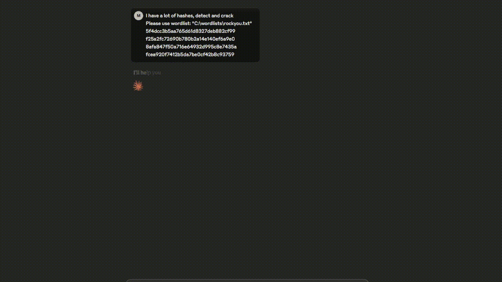

# Hashcat MCP Server 🔥


A powerful Model Context Protocol (MCP) server that provides intelligent hashcat integration for Claude Desktop. Crack hashes, analyze passwords, and perform security assessments directly from your Claude conversations.

## ✨ Features

- **Smart Hash Identification** - Automatically detect hash types with confidence scoring
- **Multiple Attack Modes** - Dictionary, brute-force, hybrid, and rule-based attacks
- **Batch Processing** - Crack multiple hashes simultaneously
- **Session Management** - Track and monitor cracking progress
- **GPU Monitoring** - Real-time hardware performance metrics
- **Password Analysis** - Analyze cracked passwords for security insights
- **Auto Attack Strategies** - Intelligent attack sequence selection
- **Security Hardened** - Input validation and injection protection

## 🎬 Demo



*Watch the Hashcat MCP Server in action - from hash identification to successful cracking!*

## 🛡️ RootSec Community
Join our cybersecurity community for the latest in offensive security, AI integration, and advanced penetration testing techniques:

**🔗 [t.me/root_sec](https://t.me/root_sec)**

RootSec is a community of security professionals, researchers, and enthusiasts sharing knowledge about:
- Advanced penetration testing techniques
- AI-powered security tools
- Red team methodologies
- Security research and development
- Industry insights and discussions

## 🚀 Quick Start

### 1. Install Dependencies

```bash
pip install -r requirements.txt
```

### 2. Configure Claude Desktop

Edit your Claude Desktop config file:

**Windows:** `%APPDATA%\Claude\claude_desktop_config.json`
**Mac:** `~/Library/Application Support/Claude/claude_desktop_config.json`

```json
{
    "mcpServers": {
        "Hashcat-MCP": {
            "command": "python",
            "args": [
                "C:\\path\\to\\your\\hashcat_mcp_server.py"
            ],
            "env": {
                "HASHCAT_PATH": "C:\\path\\to\\hashcat\\hashcat.exe",
                "HASHCAT_SAFE_DIRS": "C:\\wordlists"
            }
        }
    }
}
```

**Important:** Update the paths to match your system:
- `args[0]` - Path to your `hashcat_mcp_server.py` file
- `HASHCAT_PATH` - Path to your hashcat executable
- `HASHCAT_SAFE_DIRS` - Comma-separated list of safe directories for wordlists

### 3. Restart Claude Desktop

Close and reopen Claude Desktop to load the MCP server.

## 🔧 Configuration

### Required Environment Variables

- `HASHCAT_PATH` - Path to hashcat executable (required)

### Optional Environment Variables

- `HASHCAT_SAFE_DIRS` - Safe directories for wordlists (recommended)
- `HASHCAT_LOG_LEVEL` - Logging level: DEBUG, INFO, WARNING, ERROR (default: DEBUG)

## 📖 Usage Examples

### Basic Hash Identification
```
Can you identify this hash: 5d41402abc4b2a76b9719d911017c592
```

### Crack a Hash
```
Crack this NTLM hash: 76268997E3979AFB37AC1C653E3ABBDD
Use wordlist: C:\wordlists\rockyou.txt
```

### Auto Attack Strategy
```
Run an automatic attack on this hash: 098f6bcd4621d373cade4e832627b4f6
Give it 30 minutes to try different strategies
```

### Batch Processing
```
Crack these hashes:
- 5d41402abc4b2a76b9719d911017c592
- 098f6bcd4621d373cade4e832627b4f6
- 76268997E3979AFB37AC1C653E3ABBDD
```

## 📊 Supported Hash Types

The server supports 400+ hash types including:

- **Raw Hashes:** MD5, SHA1, SHA256, SHA512
- **Operating Systems:** NTLM, bcrypt, sha512crypt, md5crypt
- **Network Protocols:** WPA/WPA2, Kerberos
- **Applications:** MySQL, PostgreSQL, Oracle
- **And many more...**

## 🔍 Available Functions

- `smart_identify_hash()` - Enhanced hash identification
- `crack_hash()` - Crack single hash with various attack modes
- `crack_multiple_hashes()` - Batch hash cracking
- `auto_attack_strategy()` - Intelligent automated attacks
- `benchmark_hashcat()` - Performance benchmarking
- `get_gpu_status()` - Hardware monitoring
- `analyze_cracked_passwords()` - Password security analysis
- `generate_smart_masks()` - Intelligent brute-force patterns
- `estimate_crack_time()` - Time estimation for attacks

## ⚠️ Disclaimer

This tool is for educational and authorized security testing purposes only. Always ensure you have proper authorization before testing any systems or hashes that don't belong to you.

## 📄 License

This project is licensed under the MIT License - see the LICENSE file for details.

---

**Happy Hashing! 🔓** 